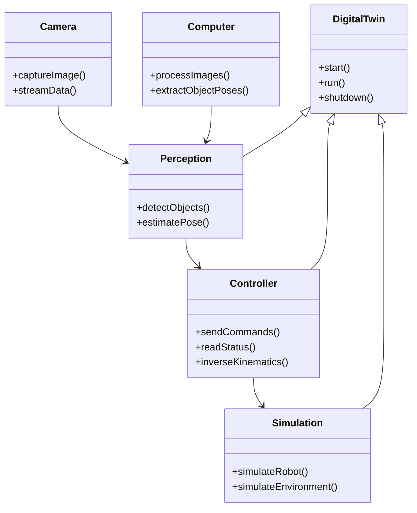

# Agnostic Digital Twin Robotic Controller

## Installation Instructions

Python Version: `3.11.3`

```bash
git clone https://github.com/MGross21/Agnostic-Digital-Twin-Robotic-Controller
cd Agnostic-Digital-Twin-Robotic-Controller
python -3.11 -m venv dt-env
pip install poetry
poetry install
```

## Core Structure of Digital Twin


