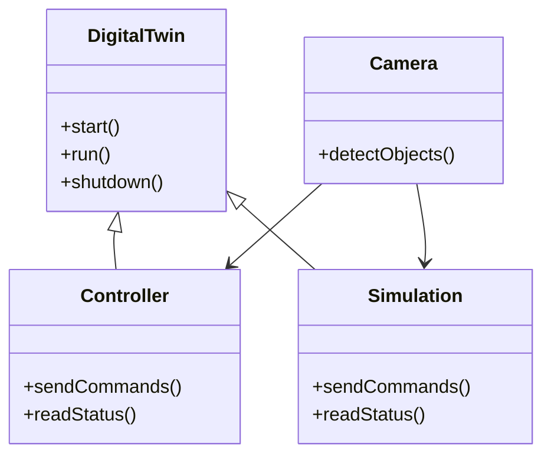

# Agnostic Digital Twin Robotic Controller

## Installation Instructions

Python Version: `3.11.3`

```bash
git clone https://github.com/MGross21/Agnostic-Digital-Twin-Robotic-Controller
cd Agnostic-Digital-Twin-Robotic-Controller
chmod +x setup_and_run.sh
./setup_and_run.sh
```

## Core Structure of Digital Twin

