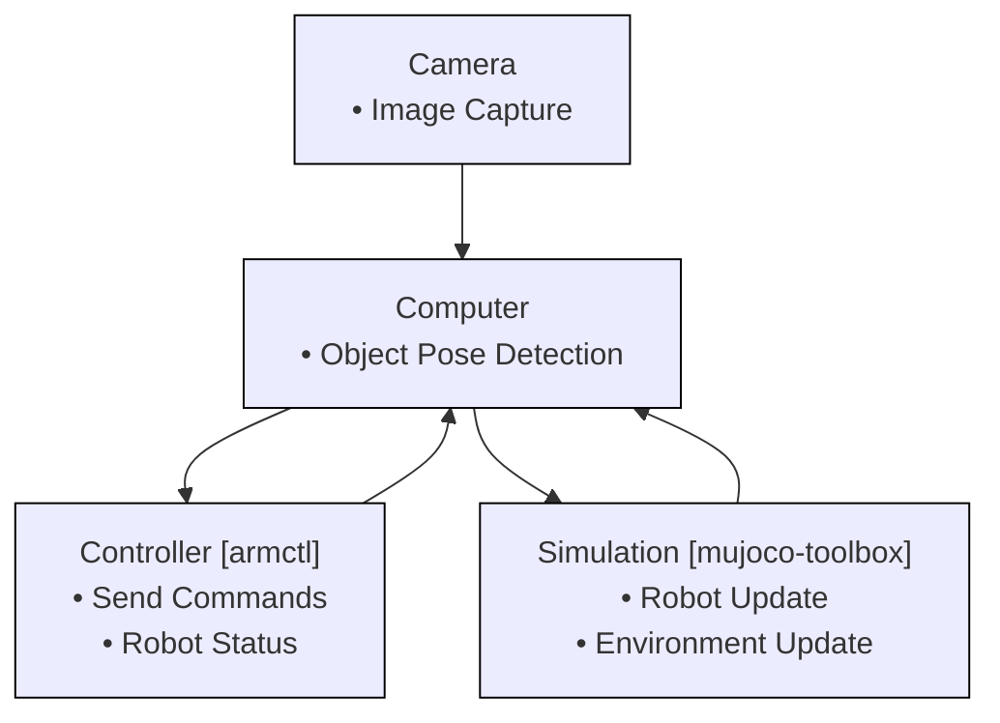
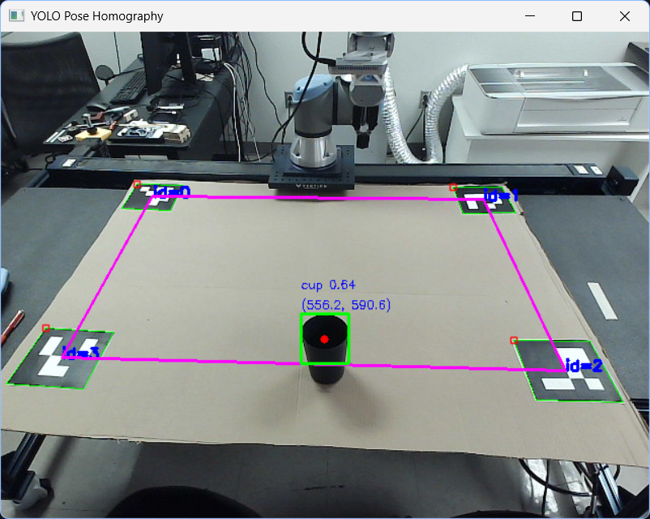

# Glovebox Digital Twin

This project integrates the [mujoco-toolbox](https://github.com/MGross21/mujoco-toolbox) and [armctl](https://github.com/MGross21/armctl) repositories. Developed as part of a master's thesis at Arizona State University.


## Installation Instructions

> [!Note]
> For non-Windows users, installation steps may vary slightly. Adjust the commands according to your operating system.

Python Version: `3.11`

```bash
winget install --id=Python.Python.3.11 -e
```

```bash
git clone https://github.com/MGross21/glovebox-digitaltwin
cd glovebox-digitaltwin
py -3.11 -m venv .venv
.\.venv\Scripts\activate
python.exe -m pip install --upgrade pip
pip install poetry
poetry install
```

## Core Structure of Digital Twin



## Visual Representation


## Physical Implementation

| **View**          | **Before**                                      | **After**                                       |
|--------------------|------------------------------------------------|------------------------------------------------|
| **Regular Camera** |  |  |
| **Flat**           |      |      |
| **Sim**            |        |        |
| **External**       | | |

### Cup Location Tracking


