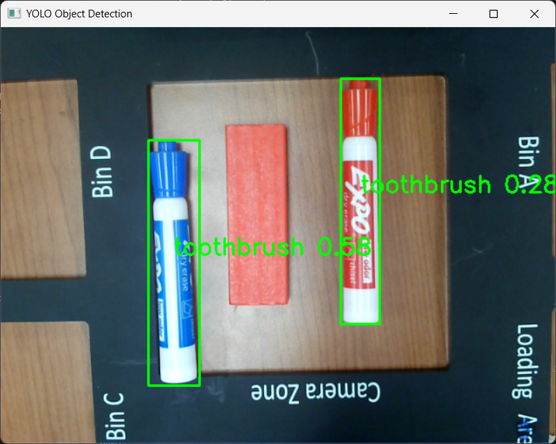

# Digital Twin Project Progress

Outlines Critical Progress Updates

## First Test

Date: `February 6, 2025`

1. Socket Connection
2. Turn on Robot
3. Connect Sequence
   1. Power On
   2. State On
4. Get Request
   1. Get Angles
5. Shutdown Sequence
   1. Stop Task
   2. State Off
   3. Power Off

```python
with UniversalRobotics("192.168.1.159", 5001) as ur5:
   ur5.get_joint_positions()
```

```bash
2025-02-12 13:18:11,350 - INFO - Connected to 192.168.1.159:5001
2025-02-12 13:18:11,351 - INFO - Sending command:   power_on()
2025-02-12 13:18:11,954 - INFO - Received response: power_on:[ok]
2025-02-12 13:18:11,954 - INFO - Sending command:   state_on()
2025-02-12 13:18:12,647 - INFO - Received response: state_on:[ok]
2025-02-12 13:18:12,647 - INFO - Sending command:   get_angles()
2025-02-12 13:18:12,663 - INFO - Received response: get_angles:[0.290562,-95.891321,-74.804509,-162.949219,1.845703,12.041016]
2025-02-12 13:18:12,663 - INFO - Sending command:   task_stop()
2025-02-12 13:18:13,466 - INFO - Received response: task_stop:[ok]
2025-02-12 13:18:13,466 - INFO - Sending command:   state_off()
2025-02-12 13:18:14,176 - INFO - Received response: state_off:[ok]
2025-02-12 13:18:14,176 - INFO - Sending command:   power_off()
2025-02-12 13:18:14,176 - INFO - Received response: power_off:[ok]
2025-02-12 13:18:14,176 - INFO - Disconnected from robot
```

## Computer Vision

Date: `February 21, 2025`

**Toothbrush?** Will have to look into other models in the future that have better common object detection.



### Output

List of Tuples Describing Center of Each Boundary Box

```bash
0: 480x640 2 toothbrushs, 281.5ms
Speed: 2.0ms preprocess, 281.5ms inference, 1.0ms postprocess per image at shape (1, 3, 480, 640)
Detected keypoints: [(0.46652970314025877, 0.5224477132161458), (0.6760946273803711, 0.5291166305541992)]
```

### Coordinate System

*Top Left is Origin*
Normalizing the camera frame will allow for any camera to be used. In future steps, the pixel location can be converted to real world coordinate postitions.

#### Drawbacks

* Will require `x` and `y` camera as isometric RGB does not translate the required depth of field.

Will look into RGBD and/or Trained 6DOF Pose Model at a future date.

```ascii
-------------------------------------------------------
| (0,0)                                         (1,0) |
|                                                     |
|                                                     |
|                                                     |
|                   CAMERA FRAME                      |
|                                                     |
|                                                     |
|                                                     |
|                                                     |
| (0,1)                                         (1,1) |
-------------------------------------------------------
 ```
